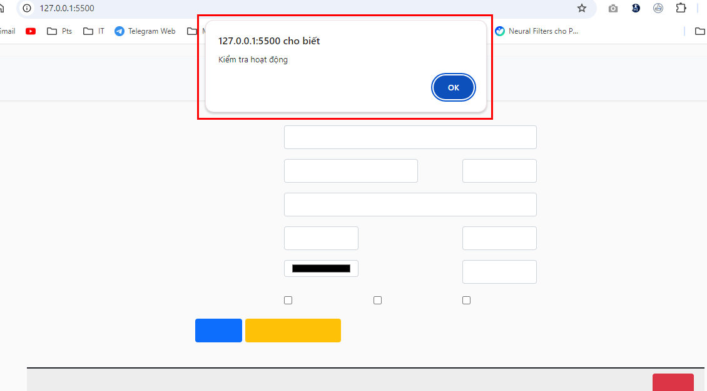

# Quản lý thú cứng

Ngày 30/8/2024 

Kiểm tra hoạt động của hàm validate. 
Kiểm tra hàm xoá danh sách bảng.
Đã lấy được các trường cơ bản, chưa đúng định dạng ngày.

Ngày 29/8/2024

{@codeopen: https://phamvanapts.github.io/pet/}

Ghi chú lại tài liệu từng bước thực hiện.

{@codeopen: https://docs.google.com/document/d/1KBBoNo-WF5uZRUimjRJHU9FIlbcWUowvIg_R0Y6TRpo/edit?usp=sharing}

1. Xem mã nguồn code

Hiểu được cấu trúc dự án và mã nguồn HTML, CSS

2. Kiểm tra hoạt động 
